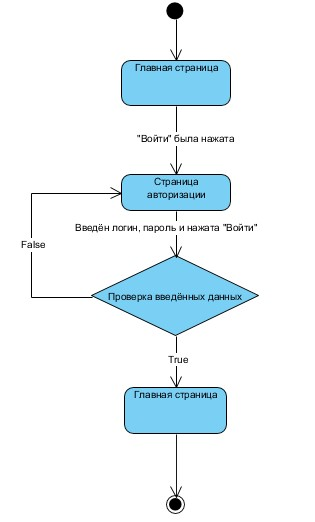
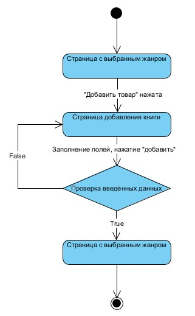
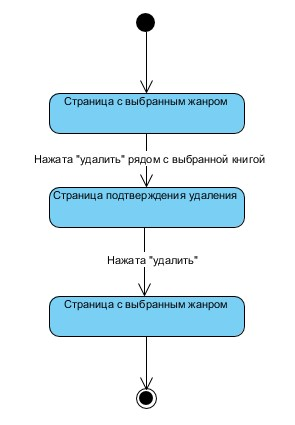
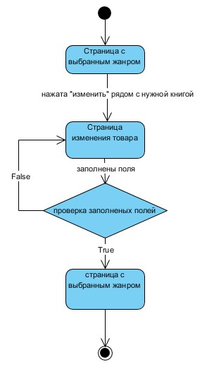
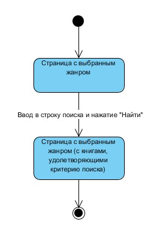
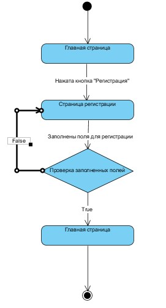

# Диаграммы состояния
---

# Содержание
1. [Авторизация на сайте](#1)
2. [Добавление товара](#2)
3. [Удаление товара](#3)
4. [Изменение товара](#4)
5. [Поиск](#5)
6. [Регистрация](#6)

### 1. Авторизация на сайте

### 2. Добавление товара

  
### 3. Удаление товара

### 4. Изменение товара

### 5. Поиск

### 6. Регистрация

